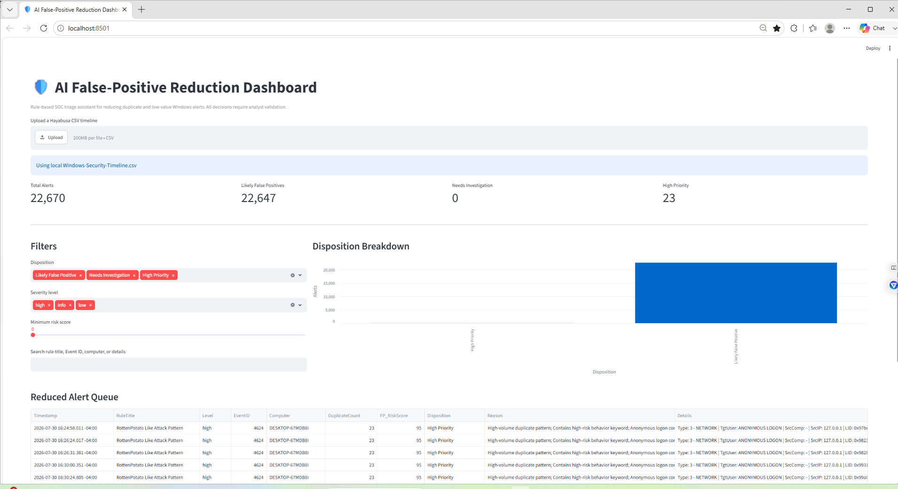
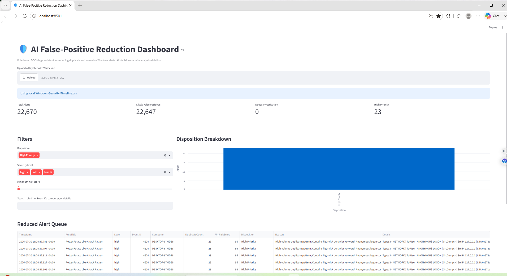

# Darwin-SOC-AI-False-Positive-Reduction-Dashboard

SOC Tier 1 Streamlit dashboard using Python, Pandas, and Hayabusa timeline data to reduce duplicate alerts, estimate false-positive likelihood, prioritize high-risk events, and export a focused analyst queue.

> The current dashboard uses transparent rule-based scoring rather than a generative AI model. The project is designed as an AI-ready triage workflow that can later incorporate Ollama or another local model for additional explanations.

---

## 🎯 Project Objectives

- Load a Hayabusa CSV security timeline
- Analyze thousands of Windows security alerts
- Identify repeated and duplicate alert patterns
- Estimate false-positive likelihood
- Assign local risk scores from 0 to 100
- Separate alerts into analyst-friendly dispositions
- Prioritize suspicious Windows activity
- Provide reasons for each score
- Filter alerts by severity, score, and keywords
- Export a reduced alert queue to CSV
- Preserve human analyst validation before closure or containment

---

## 🧠 Why This Project Matters

SOC analysts often face alert fatigue caused by:

- Repeated detections
- Low-value informational events
- Routine Windows activity
- Duplicate alerts from the same rule
- Alerts missing important context
- Large event volumes
- False positives that consume investigation time

This dashboard helps organize the queue into three categories:

```text
Likely False Positive
Needs Investigation
High Priority
```

The goal is not to automatically close alerts.

The goal is to help a Tier 1 analyst focus attention on the events most likely to require investigation.

---

## 🛠️ Technologies Used

- Python
- Streamlit
- Pandas
- Hayabusa
- Windows Security Event Logs
- PowerShell
- CSV
- Visual Studio Code
- Windows 11
- SOC Tier 1 triage methods

---

## 🏗️ Workflow

```text
Windows Security.evtx
        ↓
Hayabusa detection rules
        ↓
Windows-Security-Timeline.csv
        ↓
Pandas alert processing
        ↓
Duplicate-pattern detection
        ↓
Local risk scoring
        ↓
Disposition assignment
        ↓
Streamlit dashboard
        ↓
Reduced analyst alert queue
        ↓
Human analyst validation
```

---

## 📁 Repository Structure

```text
Darwin-AI-False-Positive-Reduction-Dashboard/
│
├── dashboard.py
├── README.md
├── .gitignore
│
└── screenshots/
    ├── 01-AI-False-Positive-Reduction-Dashboard-Overview.png
    └── 02-AI-False-Positive-High-Priority-Queue.png
```

The original Hayabusa timeline is intentionally excluded because Windows event data may contain local usernames, hostnames, security identifiers, IP addresses, and other sensitive information.

---

## ⚙️ Environment Setup

### 1. Create the project folder

```powershell
cd "C:\Users\Darwin Brown\Downloads"
mkdir AI-False-Positive-Dashboard
cd .\AI-False-Positive-Dashboard
```

### 2. Create a virtual environment

```powershell
python -m venv fpvenv
```

### 3. Activate the environment

```powershell
.\fpvenv\Scripts\Activate.ps1
```

### 4. Install dependencies

```powershell
python -m pip install streamlit pandas ollama
```

### 5. Copy the Hayabusa timeline

```powershell
Copy-Item "C:\Users\Darwin Brown\Downloads\hayabusa-3.10.0-win-x64\Windows-Security-Timeline.csv" ".\Windows-Security-Timeline.csv"
```

---

## ▶️ Running the Dashboard

Start the application with:

```powershell
python -m streamlit run dashboard.py
```

The dashboard opens locally at:

```text
http://localhost:8501
```

The application can either:

- Automatically load `Windows-Security-Timeline.csv`
- Accept another Hayabusa CSV through the upload control

---

## 🔍 Alert Scoring Logic

The dashboard assigns a starting score based on the Hayabusa detection level.

Example values:

| Hayabusa level | Starting score |
|---|---:|
| Critical | 100 |
| High | 80 |
| Medium | 55 |
| Low | 25 |
| Informational | 10 |

The score is then adjusted using event context.

### Duplicate-pattern adjustment

A repeated alert pattern with ten or more matches reduces the score:

```text
-25 points
```

This helps identify noisy or repetitive detections, but repetition alone does not prove an alert is benign.

### Common Windows activity

Events matching common activity such as startup, logoff, credential access noise, or service startup can receive:

```text
-20 points
```

### High-risk terms

Alerts containing terms such as:

```text
RottenPotato
Mimikatz
Credential Dumping
PowerShell
Ransomware
Malware
Privilege Escalation
Anonymous Logon
```

can receive:

```text
+25 points
```

### Anonymous logon context

Alerts containing anonymous-logon activity receive:

```text
+15 points
```

because the activity requires additional analyst validation.

### Missing host context

Alerts without a computer value receive:

```text
-10 points
```

because the evidence is incomplete.

---

## 📊 Disposition Thresholds

```text
75–100: High Priority
40–74:  Needs Investigation
0–39:   Likely False Positive
```

These thresholds are demonstration logic created for this lab.

They are not a replacement for:

- Organizational security policy
- SIEM detection logic
- Incident-response playbooks
- Threat-intelligence validation
- Analyst judgment

---

## 📸 Dashboard Screenshots

### 1. AI False-Positive Reduction Dashboard Overview



The dashboard processed:

```text
22,670 total alerts
22,647 likely false positives
0 alerts needing investigation
23 high-priority alerts
```

The overview displays:

- Total alert count
- Estimated false-positive count
- Alerts requiring investigation
- High-priority count
- Disposition chart
- Severity filters
- Minimum-risk slider
- Keyword search
- Reduced alert queue

The large false-positive estimate demonstrates how duplicate and lower-severity activity can dominate a Windows event timeline.

It also reveals a limitation in the first scoring model: no alerts landed in the middle category. Future tuning should create a more balanced distribution.

---

### 2. AI False-Positive High-Priority Queue



The dashboard was filtered to show only:

```text
High Priority
```

The resulting queue contained:

```text
23 alerts
```

The visible alerts included:

```text
Rule: RottenPotato Like Attack Pattern
Level: High
Event ID: 4624
Duplicate count: 23
Risk score: 95
Disposition: High Priority
```

The scoring explanation included:

- High-volume duplicate pattern
- High-risk behavior keyword
- Anonymous-logon context

Although the event pattern was repeated, its suspicious rule title and authentication context kept the risk score high.

---

## 🚨 Detection Analysis

The high-priority queue contained events associated with:

```text
RottenPotato Like Attack Pattern
```

The records involved Windows Event ID:

```text
4624
```

Event ID 4624 represents a successful account logon.

A successful logon is not automatically malicious. Analysts should review:

- Logon type
- Target account
- Target domain
- Source IP address
- Source workstation
- Authentication package
- Process information
- Logon ID
- Time and frequency
- Nearby privilege events
- Whether the activity was expected

The detection should be treated as an investigation lead rather than proof of compromise.

---

## 🔎 SOC Tier 1 Investigation Process

A Tier 1 analyst reviewing a high-priority alert should:

1. Open the original event details.
2. Confirm the event timestamp.
3. Review the affected computer.
4. Identify the target user.
5. Review the logon type.
6. Examine the source address and source port.
7. Search for related Event IDs.
8. Compare the activity with normal host behavior.
9. Review EDR process and network telemetry.
10. Check whether the rule generated repeated matches.
11. Determine whether the alert is expected, suspicious, or malicious.
12. Document the evidence.
13. Escalate only when the available evidence supports escalation.

---

## 📥 Reduced Alert Queue Export

The dashboard includes a download button that creates:

```text
Reduced-Alert-Queue.csv
```

The exported queue can include:

- Timestamp
- Rule title
- Severity level
- Event ID
- Computer
- Duplicate count
- False-positive risk score
- Disposition
- Scoring reason
- Event details

This report can support:

- Analyst handoff
- Case documentation
- Escalation
- Alert tuning
- False-positive review
- Detection-engineering feedback

---

## 🧠 Human-in-the-Loop Validation

The dashboard does not automatically:

- Close alerts
- Disable accounts
- Block IP addresses
- Isolate computers
- Delete events
- Suppress detection rules
- Mark incidents as resolved

Every result requires analyst validation.

A low score does not prove an alert is harmless.

A high score does not prove that a system has been compromised.

---

## ⚠️ Limitations

The current version uses locally defined scoring rules.

Limitations include:

- Keyword-based classification
- No asset criticality
- No user-baseline information
- No historical behavioral profile
- No threat-intelligence enrichment
- No allowlist management interface
- No automatic MITRE ATT&CK validation
- No confidence measurement
- Duplicate alerts may still represent repeated attacks
- The thresholds require additional tuning
- The middle disposition currently contains no alerts in the sample dataset

The project name includes “AI” because it is designed as an AI-assisted dashboard concept, but the displayed scoring engine is presently rule-based and explainable.

---

## 🔮 Future AI Integration

A future version could send selected alerts to a local Ollama model for:

- Plain-English alert explanations
- Investigation-question generation
- MITRE ATT&CK suggestions
- Missing-context identification
- Analyst note drafting
- False-positive reasoning
- Escalation-summary generation

AI output should remain advisory and should never replace evidence-based analyst review.

---

## 🧠 What I Learned

- How to build a Streamlit security dashboard
- How to process large CSV timelines with Pandas
- How to create explainable alert-scoring logic
- How to identify duplicate alert patterns
- How to classify alerts by disposition
- How to create dashboard filters
- How to visualize alert counts
- How to build a reduced analyst queue
- How to export filtered results
- How false-positive reduction can improve SOC efficiency
- Why duplicate alerts cannot automatically be dismissed
- Why transparent scoring is important in security automation

---

## 💼 Skills Demonstrated

- SOC Tier 1 alert triage
- False-positive analysis
- Alert prioritization
- Python
- Streamlit
- Pandas
- Hayabusa
- Windows Event Logs
- CSV processing
- PowerShell
- Risk scoring
- Duplicate detection
- Dashboard development
- Data filtering
- Security automation
- Analyst workflow design
- Explainable decision logic
- Incident documentation
- Human-in-the-loop review

---

## 🚀 Future Improvements

- Tune thresholds to populate the middle disposition
- Add editable allowlists
- Add asset-criticality scoring
- Add user and host baselines
- Add event-frequency timelines
- Add Event ID distribution charts
- Add rule-title frequency charts
- Add top-host and top-user views
- Add VirusTotal enrichment
- Add AbuseIPDB enrichment
- Add local Ollama explanations
- Add MITRE ATT&CK mapping
- Add analyst notes
- Add case numbers
- Add alert status tracking
- Add confidence scores
- Add detection-rule tuning recommendations
- Add authentication anomaly detection
- Add Streamlit authentication
- Add SQLite storage
- Add SIEM integration

---

## 🔐 Privacy and Security

Hayabusa timelines may contain:

- Usernames
- Computer names
- Domain names
- Security identifiers
- IP addresses
- Authentication details
- Process information
- Local account information

Do not upload private event data to a public repository.

The following files should remain excluded:

```text
Windows-Security-Timeline.csv
Reduced-Alert-Queue.csv
fpvenv/
```

---

## 🧹 Recommended `.gitignore`

```gitignore
fpvenv/
venv/
.env
__pycache__/
*.pyc
Windows-Security-Timeline.csv
Reduced-Alert-Queue.csv
*.evtx
```

---

## ⚠️ Disclaimer

This project was completed in a controlled environment using event data from a personally controlled Windows system.

It is intended only for:

- Cybersecurity education
- SOC analyst training
- Defensive-security automation
- False-positive research
- Portfolio development

No unauthorized systems were accessed.

---

## 🙏 Project Credit

The source event timeline was generated using **Hayabusa**, an open-source Windows event-log threat-hunting and forensic timeline tool created by Yamato Security.

This repository documents my own:

- Streamlit dashboard
- Pandas processing workflow
- Alert-scoring logic
- Duplicate detection
- Disposition rules
- Filters
- Reduced alert queue
- CSV export
- Screenshots
- SOC Tier 1 analysis

- Author: Darwin Brown
- Aspiring SOC Tier 1 analyist
